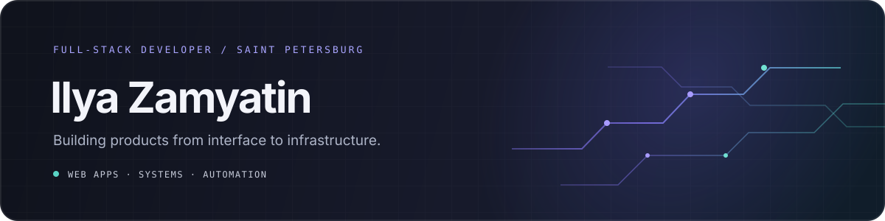

  

### I build useful software, from polished interfaces to the systems behind them.

Full-stack developer at **RES Technology** · ITMO University · Saint Petersburg, Russia

[**Portfolio**](https://kvaigoyn.github.io/portfolio/) &nbsp;·&nbsp; [**Projects**](https://github.com/KvaiGoyn?tab=repositories)

---

## What I work on

I enjoy taking a product from its first screen to the services and automation that keep it running. Lately, that means web applications, internal tools, and infrastructure around CS2 servers.

## Selected work

<table>
  <tr>
    <td width="50%" valign="top">
      <strong><a href="https://github.com/KvaiGoyn/CS2_server">CS2 Server Manager</a></strong> 
      Desktop control panel for creating and managing Counter-Strike 2 servers.  
      Electron · Vue · JavaScript
    </td>
    <td width="50%" valign="top">
      <strong><a href="https://github.com/KvaiGoyn/RESSpace-CS2-Egg">CS2 Pterodactyl Egg</a></strong> 
      Server setup and maintenance automation, with custom scripts and documentation.  
      Shell · Pterodactyl · CS2
    </td>
  </tr>
  <tr>
    <td width="50%" valign="top">
      <strong><a href="https://github.com/KvaiGoyn/CS2_server_v2">CS2 Server Manager v2</a></strong> 
      A new iteration of a desktop tool for server administration.  
      TypeScript · Electron
    </td>
    <td width="50%" valign="top">
      <strong><a href="https://kvaigoyn.github.io/portfolio/">Personal portfolio</a></strong> 
      A closer look at my work, experience, and projects.  
      HTML · CSS · JavaScript
    </td>
  </tr>
</table>

## Tools I use

  
  
  
  
  
  

## Say hello

For more about me and my work, visit **[kvaigoyn.github.io/portfolio](https://kvaigoyn.github.io/portfolio/)**.

  Thanks for stopping by — feel free to explore the repos.

